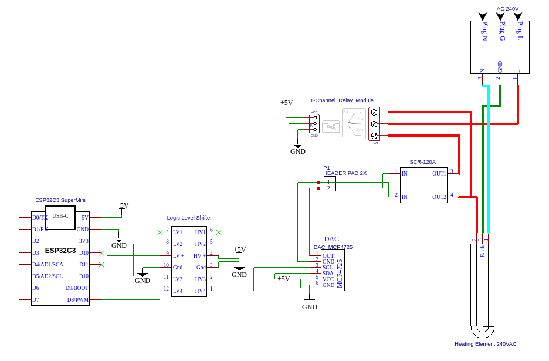

# AC Export Diversion controller
This device allows the controlled energy diversion into a resistive load.
Its purpose is to utilise otherwise exported solar energy by dumping it into a hot water cylinder.
Because the amount of exported solar energy varies, the amount of being diverted into the HWC must also vary.
---
== WARNING ==

This project deals with high voltage, high current AC electricity. Do not attempt to replicate unless you know what you are doing.

---

## Alternative
There is an off the shelf device that seem to do the same thing as this project. 

I have not tested this device, it might be a good alternative for some people: [3kw Solar Immersion Controller Power Distributor](https://s.click.aliexpress.com/e/_De9Gy9j)


## Hardware
* [ESP32-C3 SuperMini Dev Board](https://s.click.aliexpress.com/e/_DEkIgvN)
* [MCP4725 I2C DAC](https://s.click.aliexpress.com/e/_Dd37UpH)
* [30A Relay Module 5V](https://s.click.aliexpress.com/e/_DFhWROL)
* [3.3V/5V Logic Level Converter](https://s.click.aliexpress.com/e/_Dkny60b)
* [SCR Regulator 120A](https://s.click.aliexpress.com/e/_DmAf18X)
* [SSR Heat Sink DIN Rail Mount](https://s.click.aliexpress.com/e/_DnF24jp)

## Installation
Install [ESPHome](https://esphome.io/guides/installing_esphome.html)

Create a ```secrets.yaml``` file and add your Wi-Fi credentials in this format

wifi_ssid: '<SSID>'
wifi_password: '<PASSWORD>'


Then run: ```esphome run diversion.yaml```
## Wiring Diagram

## PCB
[Gerber Files](assets/diversion-gerber.zip)


## Implemented


## Example Home Assistant Automation
This example automation which continually adjusts the power going to the hot water cylinder element (fan.hwc_controller) based on the amount of power being exported (sensor.emoncms_grid_consumption)

The target export power has been set to 100W as an attempt to avoid overshot and inadvertent power import under certain weather conditions (i.e. frequent, intermittent cloud coverage)

It also increases/decreases in varying increments based on the amount of import/exported power
```
alias: Map Export to Diversion
description: ""
trigger:
  - platform: state
    entity_id:
      - sensor.emoncms_grid_consumption
condition: []
action:
  - if:
      - condition: numeric_state
        entity_id: sensor.emoncms_grid_consumption
        below: -100
    then:
      - service: fan.increase_speed
        data:
          percentage_step: 1
        target:
          entity_id: fan.hwc_controller
    else:
      - service: fan.decrease_speed
        data:
          percentage_step: 1
        target:
          entity_id: fan.hwc_controller
    enabled: false
  - choose:
      - conditions:
          - condition: numeric_state
            entity_id: sensor.emoncms_grid_consumption
            above: 100
        sequence:
          - service: fan.decrease_speed
            data:
              percentage_step: 10
            target:
              entity_id: fan.hwc_controller
      - conditions:
          - condition: numeric_state
            entity_id: sensor.emoncms_grid_consumption
            above: 0
            below: 100
        sequence:
          - service: fan.decrease_speed
            data:
              percentage_step: 5
            target:
              entity_id: fan.hwc_controller
      - conditions:
          - condition: numeric_state
            entity_id: sensor.emoncms_grid_consumption
            above: -100
            below: 0
        sequence:
          - service: fan.decrease_speed
            data:
              percentage_step: 1
            target:
              entity_id: fan.hwc_controller
      - conditions:
          - condition: numeric_state
            entity_id: sensor.emoncms_grid_consumption
            below: -100
            above: -200
        sequence:
          - service: fan.increase_speed
            data:
              percentage_step: 1
            target:
              entity_id: fan.hwc_controller
      - conditions:
          - condition: numeric_state
            entity_id: sensor.emoncms_grid_consumption
            below: -200
            above: -500
        sequence:
          - service: fan.increase_speed
            data:
              percentage_step: 5
            target:
              entity_id: fan.hwc_controller
      - conditions:
          - condition: numeric_state
            entity_id: sensor.emoncms_grid_consumption
            below: -500
        sequence:
          - service: fan.increase_speed
            data:
              percentage_step: 10
            target:
              entity_id: fan.hwc_controller
mode: single
```