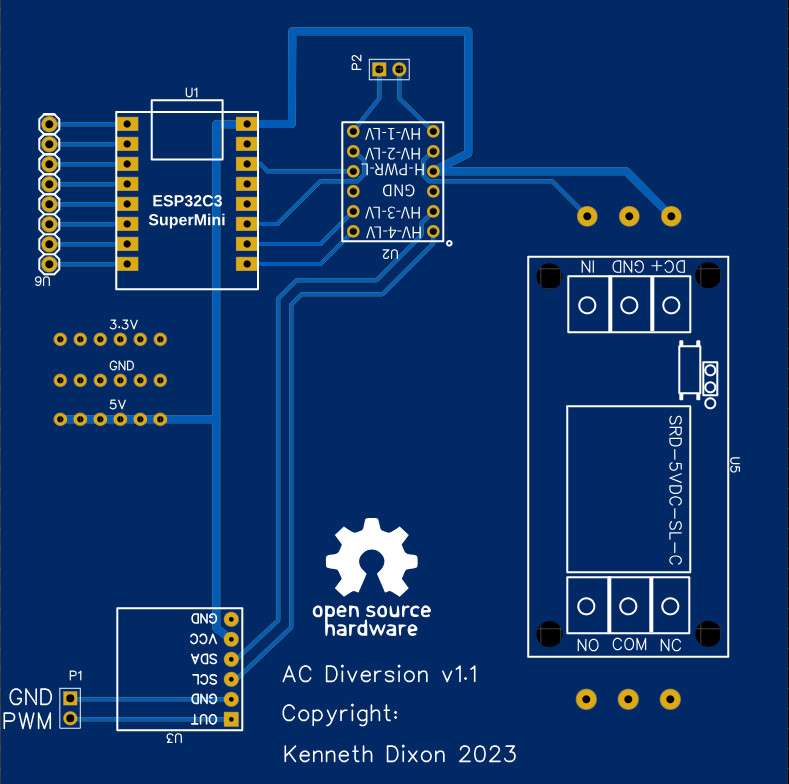

# AC Export Diversion controller
This device allows the controlled energy diversion into a resistive load.
Its purpose is to utilise otherwise exported solar energy by dumping it into a hot water cylinder.
Because the amount of exported solar energy varies, the amount of being diverted into the HWC must also vary.


## Hardware
* [ESP32-C3 SuperMini Dev Board](https://s.click.aliexpress.com/e/_DEkIgvN)
* [MCP4725 I2C DAC](https://s.click.aliexpress.com/e/_Dd37UpH)
* [30A Relay Module 5V](https://s.click.aliexpress.com/e/_DFhWROL)
* [3.3V/5V Logic Level Converter](https://s.click.aliexpress.com/e/_Dkny60b)
* [SCR Regulator 120A](https://s.click.aliexpress.com/e/_DmAf18X)
* [SSR Heat Sink DIN Rail Mount](https://s.click.aliexpress.com/e/_DnF24jp)

##Installation
Install [ESPHome](https://esphome.io/guides/installing_esphome.html)

Create a ```secrets.yaml``` file and add your Wi-Fi credentials in this format

wifi_ssid: '<SSID>'
wifi_password: '<PASSWORD>'


Then run: ```esphome run diversion.yaml```

## PCB



